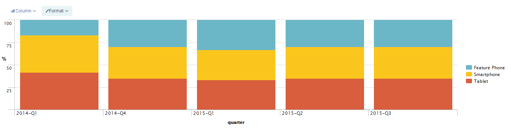
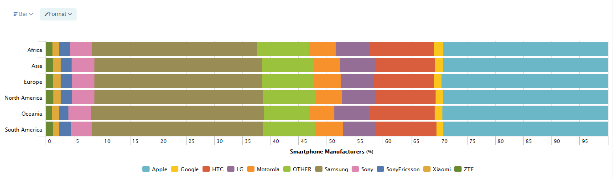
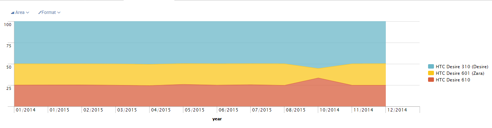

## WURFL InSight for Talend Mobile Device Analytics

### Overview
WURFL InSight provides device intelligence for Smartphones, Tablets and other Mobile Devices visiting your website. You can use a drill-down approach on the form factor, device model, operating system version, manufacturer, and over 500 other capabilities.

Using WURFL InSight for Talend, you can quickly transform your web logs to include critical mobile-first web information. Then, you can use your Business Intelligence tools to analyze trends in your Web traffic, identify opportunities, and pinpoint problems that are impacting your mobile users.

Marketing/Business Analysts, IT Operations Teams, and other Analysts across an organization will benefit from WURFL InSight. They can fine-tune their mobile Web strategy, improve their mobile users experience and interface, as well as gauging the success of advertising campaigns across specific devices, or answer a host of other business questions.

After installation, you can use the joblet to transform weblogs, append WURFL capabilities, and generate a WURFL Map. And if you need more information about the device, its capabilities, operating system, or the browser it is using, you can add more WURFL capabilities to suit your needs.

<i><b>Note:</b> WURFL InSight for Talend requires a trial license before proceeding.</i> <b><a href="http://www.scientiamobile.com/insight/inquiry/talend"><U><b>Click here</b></U> </a></b> <i>to request a license key.</i>
 

### Details
<b>Features:-</b>

Licensed customers of WURFL InSight will receive the tools to ensure their device intelligence is accurate and solves their business problems. This system will receive regular updates to keep abreast of new mobile devices and technology entering the market. Likewise, the licensed customers receive help desk support.

WURFL InSight for Talend simplifies integration of device intelligence into your data warehouse. The high performance and accuracy of the WURFL InSight joblet can quickly process millions of web logs.

<b>Benefits:-</b>

For over 10 years, ScientiaMobile has offered industry-leading device detection and intelligence solution. With WURFL InSight for Talend, we have made it simple to transform your web logs and enrich them with additional mobile device information.

With this information, organizations can:

•\tIdentify the types of devices, models, operating systems, and browsers that are visiting your site

•\tUse device intelligence in conjunction with your web-tracking solution to identify successes and conversions correlated with devices or their capabilities. Conversely, you can       identify the causes of problems leading to abandons related to devices, operating systems, and browsers.

•\tCorrelate devices to demographics or marketing segments to improve advertising targeting and effectiveness

•\tResearch the potential effectiveness of investing in emerging mobile device technologies like near field communications.
### Images

### Install Instructions
</n>
1. Download WURFL InSight for Talend ZIP file from exchange </n>
2. Extract all files and import joblet.zip to Talend Open Studio Data Integration </n>
3. Place config.properties file in C:\\WURFLInSight or /WURFLInSight.</n>
</n>
<i><b>Note:</b> WURFL InSight for Talend requires a trial license before proceeding.</i> <b><a href="http://www.scientiamobile.com/insight/inquiry/talend"><U><b>Click here</b></U> </a></b> <i>to request a license key.</i>
### Resources
 * <a href=http://www.scientiamobile.com/insight/inquiry/talend>Inquiry</a>

#### Release Notes

##### 1.8.1.12 - 2016-01-21 10:03:02
1.8.0.12
Error log generation for unprocessed records in weblog input.
### Compatible
 -  5.6 (obsolete)
 -   6.0 (obsolete)
 -   6.1 (obsolete)
 -   6.2 (obsolete)